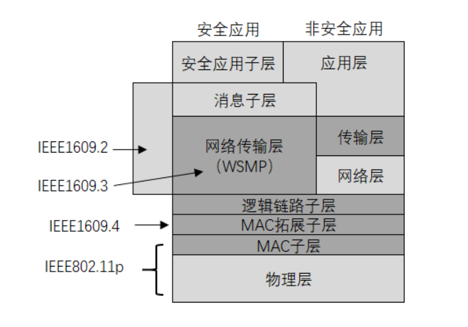
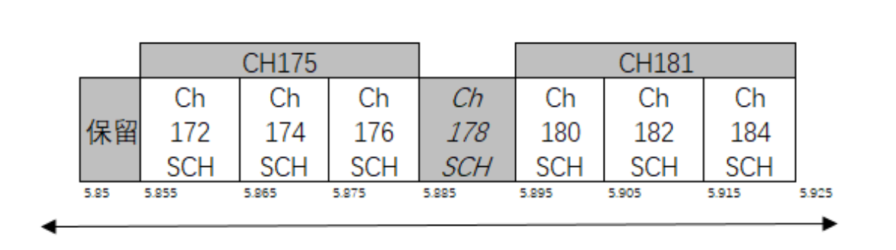
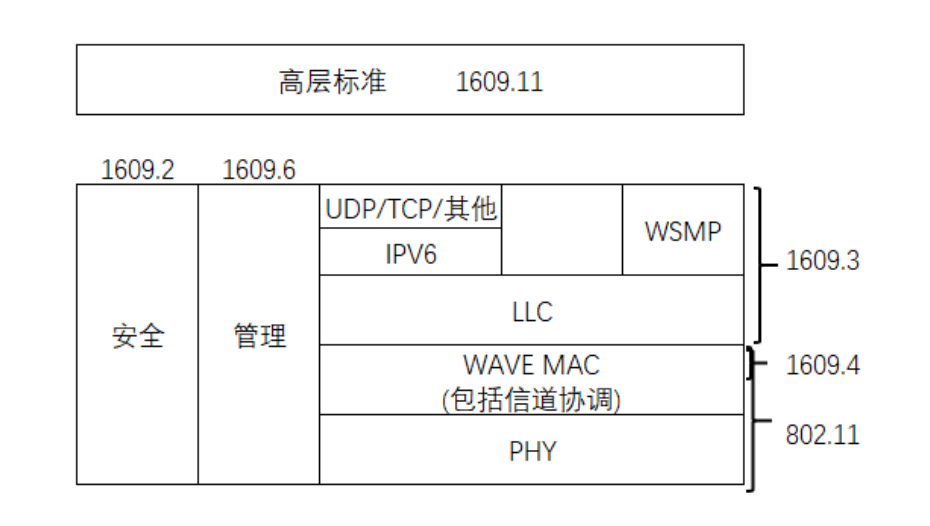
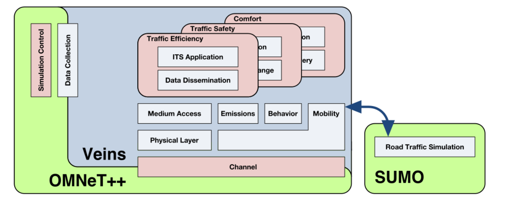
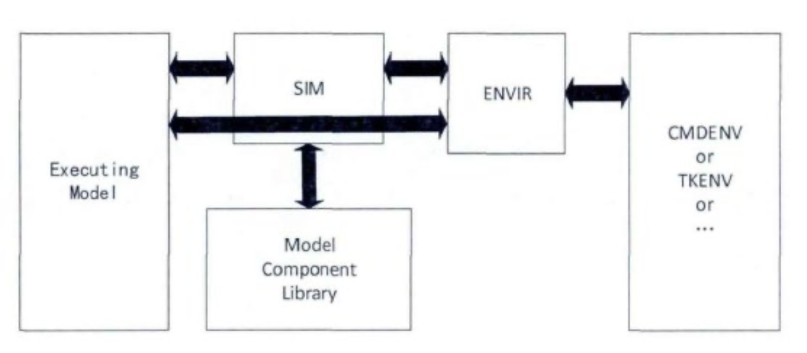

# Research and Simulation of DDoS attack in VANET

## ABSTRACT

As an important part of smart cities and intelligent transportation systems, research on VANET has become increasingly important with the development of wireless networks. Although VANET plays an important role in ensuring traffic safety, road efficiency improvement and environment protection, there is still no major breakthrough in the research on network security of VANET. As a derivative of ad hoc network, VANET has the characteristics of variable topology and fast node movement. This makes VANET more difficult to defend against malicious attacks than traditional networks.

This paper first analyzes the possible attack modes of DDoS in VANET. The WAVE protocol specifically applied to the vehicle network is discussed, and the DDoS attack mode for VANET security messages is designed based on its vulnerability. Secondly, this paper builds an experimental simulation platform based on Omnet++, SUMO, Veins. Based on this platform, a comparative experiment of various scenarios was designed and implemented. Through the collection and testing of the data, the factors that may affect the DDoS attack and the impact of the attack on VANET were analyzed. At the end, this paper summarizes the problems in the simulation experiment and introduces the related VANET security defense methods.

**KEY WORDS** VANET DDoS Veins Omnet++ SUMO

## 1  Introduction

### 1.1  Background

Urban traffic is a measure of the level of urban civilization, and it is also the lifeblood of urban life. With the development of social economy and the acceleration of urbanization, the demand for urban transportation is also growing rapidly, and transportation problems have become a major problem that plagues urban development. In terms of mobility, the Institute of Quantitative Economics and Technical Economics of the Chinese Academy of Social Sciences estimates that the loss caused by traffic congestion in Beijing is 40 million yuan per day, up to 14.6 billion yuan per year, and the nationwide loss is about 170 billion yuan per year. At the same time, urban traffic problems have also caused a lot of environmental pollution, crowded out the normal living space of residents, and caused a large number of traffic safety accidents.

Issues from safety, environment, and traffic have forced people to change their inherent transportation methods and improve road use efficiency. The Internet of Vehicles formally emerged as a product of this subject. It puts forward a solution to realize intelligent traffic by linking cars, wireless devices, drivers, and road facilities [1]. **VANET** (Vehicular Ad hoc Networks) uses cars as the communication terminal of the V2X system to build a car-oriented mobile Internet. Through real-time and efficient information interaction between vehicles and between vehicles and road test equipment, it can not only make All kinds of traffic information be fully shared among traffic equipment, but also improves the shortcomings of traditional technologies such as laser, radar and other analysis technologies in terms of distance and angle. It can improve the car’s perception of surrounding road conditions in all aspects, thereby reducing or avoiding traffic. Property losses and safety hazards caused by accidents and traffic jams. 

#### 1.1.1 about VANET

The Internet of Vehicles is also known as the Vehicle Ad Hoc Network (VANET), and this concept is derived from the Internet of Things (IOT, Internet of things). The basic idea is the interconnection between cars and cars, and between cars and roads. It uses special medium and short-range communication technology to establish a self-organizing network between vehicles and between vehicles and drive test units to achieve direct communication between nodes. Communication.

The Internet of Vehicles is a special optimization of the **Mobile Ad-hoc Network (MANET, Mobile Ad-hoc Network)** [2]. Its mobile node is the **on-board unit (OBU)** mounted on the vehicle, and the **road side unit (RSU)** can pass through the high-speed network to further connect to the backbone network to assist OBU nodes to communicate, provide network services for drivers and broadcast traffic safety information.

The application scope of the Internet of Vehicles is mainly divided into two categories: vehicle safety-related applications for improving road safety, and service applications for infotainment. They respectively correspond to the transmission of safety messages related to driving safety and the service messages related to the provision of network services. The core goal of the Internet of Vehicles is to solve road congestion and road safety problems, so safety messages are the core content of the Internet of Vehicles. By disseminating and obtaining safety messages, such as emergency braking, traffic jams, or other accident messages, other drivers can obtain useful traffic information beyond the field of view in advance, and safety applications can use these messages to cooperate with drivers to make road decisions and avoid congestion Sections, improve road utilization and driving efficiency. As it involves driving safety, safety messages must have the characteristics of quick response, high priority and short.

#### 1.1.2  current status of research on Internet of Vehicles Security

With the increase of applications and research in the VANET network, communication security issues and privacy protection issues have become increasingly prominent. Different from the traditional PC network, due to some features of VANET, such as the limited computing power of the processor embedded in the vehicle, and the restriction of the cryptography  derived from the operation and the protocol,  attacker can directly access the internal electronic components of the vehicle and reduce the user-privacy, open unlimited communication, and rapidly change network topology, which make the security solution in VANET be greatly different from the security solution of PC. Compared with traditional networks, VANET's handling of security threats will directly affect road efficiency and personal safety.

As an emerging research field, the early research focuses on the availability of VANET, and the recent research focuses on security issues. The most basic security requirements of currently recognized in-vehicle networks are as follows[3] [4]:

1. Integrity and authenticity: In the VANET network, it is necessary to ensure that the information transmitted between nodes is complete and correct, the received information and the sent information must be consistent, and the data is not allowed to be modified [10].

2. Confidentiality: For applications that require confidentiality or information that does not want to be shared, the node must have the ability to encrypt it before sending it to the vehicle network.

3. Privacy: There are a large number of private information of nodes in the VANET network -- a series of sensitive information such as vehicle speed, time, location, vehicle identification, etc. Through the collection of these information, the attacker can easily obtain the driver’s driving habits, private information such as driving route, and then launch a targeted attack. Therefore, privacy protection mechanisms should be used to avoid information leakage.

4. Verifiability: The VANET network must have the ability to authenticate each node to ensure that it is a legitimate node with credible behavior and can drive unreliable nodes out of the network.

5. Control access: VANET should set corresponding access permissions for nodes of different levels to prevent illegal nodes from invading the system and maliciously occupying resources.

In view of the features of VANET, the current research difficulties in VANET network security mainly focus on the following aspects:

1. Conditional privacy protection: Privacy protection is a very important requirement. However, in VANET, in order to ensure traffic safety and truly reflect traffic conditions, senders must share sensitive information such as their own sports status. Therefore, it is convenient for illegal information collection. However, the performance of each node based on VANET is limited to the vast and changeable topology of VANET. It is unrealistic to identify and verify each piece of information. At the same time, it is also undesirable for consumers to identify vehicles from sent messages.

2. Limited controllable message dissemination: In order to be able to disseminate effective road safety information to distant nodes, so that the driver has the ability to process information beyond the field of vision, VANET allows intermediate nodes to forward messages. However, the message conflict of Vanet using unlimited communication will also increase with the increase of the number of nodes in the network.

3. Effective identity authentication: Because VANET is a decentralized self-organizing network with a huge and changeable topology, it is difficult to rely on RSU to establish an authentication system with comprehensive coverage and efficient processing. Authentication blind spots and authentication delays are difficult to solve.

### 1.2  Task

In traditional networks, DDoS attacks are easy to implement, and at the same time have a huge impact on the entire network. In addition to using a larger amount of resources to protect its own services, there is currently no effective defense against DDoS attacks. In VANET, based on limited communication volume and message processing capabilities, DDoS attacks have become more diverse. In order to analyze the impact of DDoS attacks on VANET, it is necessary to design a quantitative method to collect and evaluate data, establish a simulated traffic network for experiments, design a specific traffic flow model and design appropriate road events, and use multiple scenarios to analyze DDoS attack's new features in VANET, and try to propose defense methods.

### 1.3  Structure

This article is divided into 5 chapters.

Chapter 1: Introduce the background knowledge of vehicle king and its safety, and recent research status.

Chapter 2: Introduce the theoretical information related to DDoS attacks, and introduce the related content of the IEEE802.11p protocol and the IEEE1609 protocol in the WAVE protocol family of the VANET network. The experimental simulation platform is introduced.

Chapter 3: VANET security services are analyzed for vulnerabilities, experimental performance analysis methods and attack schemes are designed, and detailed attack methods and scenarios are designed for the attack scheme.

Chapter 4: The structure and detailed work flow of the platform and framework required by the V ANET simulation environment are studied. The simulation platform is used to realize the experimental scenarios, and the impact of DDoS attacks on the VANET network in different scenarios is analyzed and studied.

Chapter 5: Summarize and analyze the deficiencies of research. Introduce the defense methods of VANET network against DDoS attacks.

## 2  Principles of DDoS attacks against the Internet of Vehicles

### 2.1  WAVE communication protocol of VANET

#### 2.1.1 introduction of WAVE protocol

With the research of various countries on in-vehicle communication technology and intelligent transportation network, the car networking industry has also formed a variety of communication technologies, including infrared, WiFi, wireless access in vehicle environment (WAVE) and WiMAX, etc. Each has its own specifications and standards. Among them, the WAVE protocol standard based on IEEE1609.x/802.11p formulated by the Institute of Electrical and Electronic Engineers (IEEE) is the most representative [7]. The WAVE protocol family includes two major parts, the 802.11p protocol and the 1609 protocol. This protocol is used in the Dedicated Short Range Communications (DSRC) system in the United States. The European Union, Japan and other countries all derive their own standards based on the DSRC/WAVE standards of the United States.
The DSRC/WAVE protocol stack is shown in Figure 2-1 [5]:

Figure 2-1 DSRC/WAVE protocol stack

#### 2.1.2  802.11p protocol

Corresponding to the standard seven-layer protocol, WAVE uses the 802.11p protocol as the physical layer and MAC layer. It is a customized version based on the 802.11a standard. The standard has a single-hop coverage of 300m and a data transmission rate of 3-27Mbit/s, and has optimized the traditional standard for vehicle communication environment, mobility support, and communication security.

The 802.11p standard also uses the Carrier Sense Multiple Access with Collision Avoidance (CSMA/CA,) mechanism. The sharing of wireless resources is realized between nodes through the CSMA/CA mechanism. The process can be divided into three aspects: interception, back-off, and handshake. The sender needs to detect whether other nodes are accessing channel resources by listening to the channel before sending MAC frames to the wireless channel. In order to reduce transmission collisions, a random back-off mechanism is also used. According to the backoff mechanism, the sender needs to listen to the channel for a random period of time before sending data. Only during this period of time the channel has been idle before the real transmission can be started. In terms of communication quality control, the Enhanced Distributed Channel Access (EDCA) mechanism of 802.11e is introduced to ensure low latency and high reliability of communication services.

#### 2.1.3  IEEE 1609.x protocol

The EEE 1609 standard is a high-level standard based on the 802.11p protocol; the Federal Communications Commission (FCC) of the United States allocated the 5.9 GHz frequency band to WAVE communications [13]. The spectrum includes seven 10MHz channels and one 5MHz guard interval reserved at the bottom, and the tasks of each channel are specified [8]. As shown in the figure below, Ch178 is a control channel (Control Channel, CCH), which is mainly responsible for system management information and safety-related messages. The other six channels are service channels (Service Channel, SCH), which are used for common application data transmission. Among them, Ch172 is responsible for vehicle-to-vehicle safety communications, and Ch184 is responsible for high-power, long-distance public safety communications [11].

Figure 2-2 FCC 

The IEEE1609 protocol family is mainly composed of four parts [7]:

1. IEEE1609.1 (Resource Manager): defines the format of the control channel message and the format of data storage, and has formulated a number of remote application and resource management control call process specifications.

2. IEEE1609.2 (Security Services for Applications and Management Messages): It involves security issues in WAVE communication, including signatures, encryption and other tasks.

3. IEEE1609.3 (Networking Services): specifies the standards of the WAVE network layer and transport layer, including the connection setting and management of WAVE.

4. IEEE1609.4 (Multi-Channel Operations): Defines the related operations of multi-channel communication.

Figure 2-3 structure of 1609 protocol

### 2.2  VANET Simulation Architecture Based on Omnet++

#### 2.2.1 Introduction

The vehicle networking simulation platform used in this experiment is mainly composed of three basic parts: Omnit++ simulation platform, SUMO traffic simulation platform, and Veins vehicle simulation system. Among them, the Omnet++ simulation platform is the basic system framework for the simulation of the Internet of Vehicles, which is used to build a network simulator. SUMO provides microscopic, continuous simulation of vehicle road operation. The Veins framework runs on Omnet++, responsible for the communication between nodes, and communicates with SUMO through TraCI to synchronize the simulation of vehicle motion to the simulation of Omnet++ in real time.

The overall architecture is shown in Figure 2-4 below:

Figure 2-4 structure of simulation platform

#### 2.2.2  Omnet++ simulation platform

OMNeT++ (Objective Modular Network Testbed in C++) is an extensible, modular, component-based C++ simulation library and system framework. Developed by OpenSim, it is a discrete event multi-protocol network simulation software with a perfect graphical interface.

Figure 2-5 Omnet++ structure

Figure 2-5 above shows the framework of Omnit++. The SIM module provides the core of the simulation, which is the core of the simulation platform. The ENVIR module provides the public code of the user interface and connects to the user interface. Both CMDENV and TKENV are user interfaces. CMDENV is a command line interface and TKENV provides a graphical user interface, so the corresponding operating speed is also reduced. Model Component Library stores the defined modules, models, messages and other simulation-related content. The Executing Modle module is an instantiation description of the actual operation.

Omnet++ provides tools, interfaces and corresponding simulation frameworks for network simulation. It provides a wealth of C++ simulation prototypes. At the same time, Omnit++ provides a set of effective tools for system structure simulation: embedded layered modules.

Omnet++ organizes and describes the network structure through the nesting of modules. Among them, a simple module is a module that realizes a simple single function. A new module formed by embedding multiple simple modules into one module is called a composite module. There is no limit to the nesting of modules, and when the module is instantiated, for users, there is no difference between a simple module and a conforming module. These features make it easy for users to divide a complex structure into multiple simple module stacks.