# Research and Simulation of DDoS attack in VANET

## ABSTRACT

As an important part of smart cities and intelligent transportation systems, research on VANET has become increasingly important with the development of wireless networks. Although VANET plays an important role in ensuring traffic safety, road efficiency improvement and environment protection, there is still no major breakthrough in the research on network security of VANET. As a derivative of ad hoc network, VANET has the characteristics of variable topology and fast node movement. This makes VANET more difficult to defend against malicious attacks than traditional networks.

This paper first analyzes the possible attack modes of DDoS in VANET. The WAVE protocol specifically applied to the vehicle network is discussed, and the DDoS attack mode for VANET security messages is designed based on its vulnerability. Secondly, this paper builds an experimental simulation platform based on Omnet++, SUMO, Veins. Based on this platform, a comparative experiment of various scenarios was designed and implemented. Through the collection and testing of the data, the factors that may affect the DDoS attack and the impact of the attack on VANET were analyzed. At the end, this paper summarizes the problems in the simulation experiment and introduces the related VANET security defense methods.

**KEY WORDS** VANET DDoS Veins Omnet++ SUMO

## 1  Introduction

### 1.1  Background

Urban traffic is a measure of the level of urban civilization, and it is also the lifeblood of urban life. With the development of social economy and the acceleration of urbanization, the demand for urban transportation is also growing rapidly, and transportation problems have become a major problem that plagues urban development. In terms of mobility, the Institute of Quantitative Economics and Technical Economics of the Chinese Academy of Social Sciences estimates that the loss caused by traffic congestion in Beijing is 40 million yuan per day, up to 14.6 billion yuan per year, and the nationwide loss is about 170 billion yuan per year. At the same time, urban traffic problems have also caused a lot of environmental pollution, crowded out the normal living space of residents, and caused a large number of traffic safety accidents.

Issues from safety, environment, and traffic have forced people to change their inherent transportation methods and improve road use efficiency. The Internet of Vehicles formally emerged as a product of this subject. It puts forward a solution to realize intelligent traffic by linking cars, wireless devices, drivers, and road facilities [1]. **VANET** (Vehicular Ad hoc Networks) uses cars as the communication terminal of the V2X system to build a car-oriented mobile Internet. Through real-time and efficient information interaction between vehicles and between vehicles and road test equipment, it can not only make All kinds of traffic information be fully shared among traffic equipment, but also improves the shortcomings of traditional technologies such as laser, radar and other analysis technologies in terms of distance and angle. It can improve the car’s perception of surrounding road conditions in all aspects, thereby reducing or avoiding traffic. Property losses and safety hazards caused by accidents and traffic jams. 

#### 1.1.1 about VANET

The Internet of Vehicles is also known as the Vehicle Ad Hoc Network (VANET), and this concept is derived from the Internet of Things (IOT, Internet of things). The basic idea is the interconnection between cars and cars, and between cars and roads. It uses special medium and short-range communication technology to establish a self-organizing network between vehicles and between vehicles and drive test units to achieve direct communication between nodes. Communication.

The Internet of Vehicles is a special optimization of the **Mobile Ad-hoc Network (MANET, Mobile Ad-hoc Network)** [2]. Its mobile node is the **on-board unit (OBU)** mounted on the vehicle, and the **road side unit (RSU)** can pass through the high-speed network to further connect to the backbone network to assist OBU nodes to communicate, provide network services for drivers and broadcast traffic safety information.

The application scope of the Internet of Vehicles is mainly divided into two categories: vehicle safety-related applications for improving road safety, and service applications for infotainment. They respectively correspond to the transmission of safety messages related to driving safety and the service messages related to the provision of network services. The core goal of the Internet of Vehicles is to solve road congestion and road safety problems, so safety messages are the core content of the Internet of Vehicles. By disseminating and obtaining safety messages, such as emergency braking, traffic jams, or other accident messages, other drivers can obtain useful traffic information beyond the field of view in advance, and safety applications can use these messages to cooperate with drivers to make road decisions and avoid congestion Sections, improve road utilization and driving efficiency. As it involves driving safety, safety messages must have the characteristics of quick response, high priority and short.

#### 1.1.2  current status of research on Internet of Vehicles Security

With the increase of applications and research in the VANET network, communication security issues and privacy protection issues have become increasingly prominent. Different from the traditional PC network, due to some features of VANET, such as the limited computing power of the processor embedded in the vehicle, and the restriction of the cryptography  derived from the operation and the protocol,  attacker can directly access the internal electronic components of the vehicle and reduce the user-privacy, open unlimited communication, and rapidly change network topology, which make the security solution in VANET be greatly different from the security solution of PC. Compared with traditional networks, VANET's handling of security threats will directly affect road efficiency and personal safety.

As an emerging research field, the early research focuses on the availability of VANET, and the recent research focuses on security issues. The most basic security requirements of currently recognized in-vehicle networks are as follows[3] [4]:

1. Integrity and authenticity: In the VANET network, it is necessary to ensure that the information transmitted between nodes is complete and correct, the received information and the sent information must be consistent, and the data is not allowed to be modified [10].

2. Confidentiality: For applications that require confidentiality or information that does not want to be shared, the node must have the ability to encrypt it before sending it to the vehicle network.

3. Privacy: There are a large number of private information of nodes in the VANET network -- a series of sensitive information such as vehicle speed, time, location, vehicle identification, etc. Through the collection of these information, the attacker can easily obtain the driver’s driving habits, private information such as driving route, and then launch a targeted attack. Therefore, privacy protection mechanisms should be used to avoid information leakage.

4. Verifiability: The VANET network must have the ability to authenticate each node to ensure that it is a legitimate node with credible behavior and can drive unreliable nodes out of the network.

5. Control access: VANET should set corresponding access permissions for nodes of different levels to prevent illegal nodes from invading the system and maliciously occupying resources.

In view of the features of VANET, the current research difficulties in VANET network security mainly focus on the following aspects:

1. Conditional privacy protection: Privacy protection is a very important requirement. However, in VANET, in order to ensure traffic safety and truly reflect traffic conditions, senders must share sensitive information such as their own sports status. Therefore, it is convenient for illegal information collection. However, the performance of each node based on VANET is limited to the vast and changeable topology of VANET. It is unrealistic to identify and verify each piece of information. At the same time, it is also undesirable for consumers to identify vehicles from sent messages.

2. Limited controllable message dissemination: In order to be able to disseminate effective road safety information to distant nodes, so that the driver has the ability to process information beyond the field of vision, VANET allows intermediate nodes to forward messages. However, the message conflict of Vanet using unlimited communication will also increase with the increase of the number of nodes in the network.

3. Effective identity authentication: Because VANET is a decentralized self-organizing network with a huge and changeable topology, it is difficult to rely on RSU to establish an authentication system with comprehensive coverage and efficient processing. Authentication blind spots and authentication delays are difficult to solve.

### 1.2  Task

In traditional networks, DDoS attacks are easy to implement, and at the same time have a huge impact on the entire network. In addition to using a larger amount of resources to protect its own services, there is currently no effective defense against DDoS attacks. In VANET, based on limited communication volume and message processing capabilities, DDoS attacks have become more diverse. In order to analyze the impact of DDoS attacks on VANET, it is necessary to design a quantitative method to collect and evaluate data, establish a simulated traffic network for experiments, design a specific traffic flow model and design appropriate road events, and use multiple scenarios to analyze DDoS attack's new features in VANET, and try to propose defense methods.

### 1.3  Structure

This article is divided into 5 chapters.

Chapter 1: Introduce the background knowledge of vehicle king and its safety, and recent research status.

Chapter 2: Introduce the theoretical information related to DDoS attacks, and introduce the related content of the IEEE802.11p protocol and the IEEE1609 protocol in the WAVE protocol family of the VANET network. The experimental simulation platform is introduced.

Chapter 3: VANET security services are analyzed for vulnerabilities, experimental performance analysis methods and attack schemes are designed, and detailed attack methods and scenarios are designed for the attack scheme.

Chapter 4: The structure and detailed work flow of the platform and framework required by the V ANET simulation environment are studied. The simulation platform is used to realize the experimental scenarios, and the impact of DDoS attacks on the VANET network in different scenarios is analyzed and studied.

Chapter 5: Summarize and analyze the deficiencies of research. Introduce the defense methods of VANET network against DDoS attacks.

## 2  Principles of DDoS attacks against the Internet of Vehicles

### 2.1  WAVE communication protocol of VANET

#### 2.1.1 introduction of WAVE protocol

With the research of various countries on in-vehicle communication technology and intelligent transportation network, the car networking industry has also formed a variety of communication technologies, including infrared, WiFi, wireless access in vehicle environment (WAVE) and WiMAX, etc. Each has its own specifications and standards. Among them, the WAVE protocol standard based on IEEE1609.x/802.11p formulated by the Institute of Electrical and Electronic Engineers (IEEE) is the most representative [7]. The WAVE protocol family includes two major parts, the 802.11p protocol and the 1609 protocol. This protocol is used in the Dedicated Short Range Communications (DSRC) system in the United States. The European Union, Japan and other countries all derive their own standards based on the DSRC/WAVE standards of the United States.
The DSRC/WAVE protocol stack is shown in Figure 2-1 [5]:

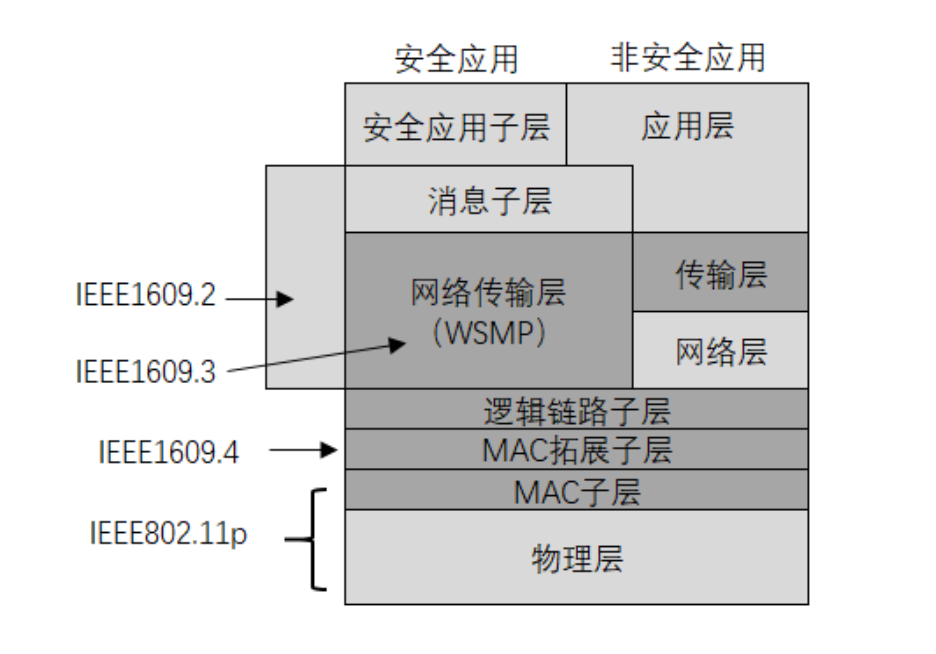

Figure 2-1 DSRC/WAVE protocol stack

#### 2.1.2  802.11p protocol

Corresponding to the standard seven-layer protocol, WAVE uses the 802.11p protocol as the physical layer and MAC layer. It is a customized version based on the 802.11a standard. The standard has a single-hop coverage of 300m and a data transmission rate of 3-27Mbit/s, and has optimized the traditional standard for vehicle communication environment, mobility support, and communication security.

The 802.11p standard also uses the Carrier Sense Multiple Access with Collision Avoidance (CSMA/CA,) mechanism. The sharing of wireless resources is realized between nodes through the CSMA/CA mechanism. The process can be divided into three aspects: interception, back-off, and handshake. The sender needs to detect whether other nodes are accessing channel resources by listening to the channel before sending MAC frames to the wireless channel. In order to reduce transmission collisions, a random back-off mechanism is also used. According to the backoff mechanism, the sender needs to listen to the channel for a random period of time before sending data. Only during this period of time the channel has been idle before the real transmission can be started. In terms of communication quality control, the Enhanced Distributed Channel Access (EDCA) mechanism of 802.11e is introduced to ensure low latency and high reliability of communication services.

#### 2.1.3  IEEE 1609.x protocol

The EEE 1609 standard is a high-level standard based on the 802.11p protocol; the Federal Communications Commission (FCC) of the United States allocated the 5.9 GHz frequency band to WAVE communications [13]. The spectrum includes seven 10MHz channels and one 5MHz guard interval reserved at the bottom, and the tasks of each channel are specified [8]. As shown in the figure below, Ch178 is a control channel (Control Channel, CCH), which is mainly responsible for system management information and safety-related messages. The other six channels are service channels (Service Channel, SCH), which are used for common application data transmission. Among them, Ch172 is responsible for vehicle-to-vehicle safety communications, and Ch184 is responsible for high-power, long-distance public safety communications [11].

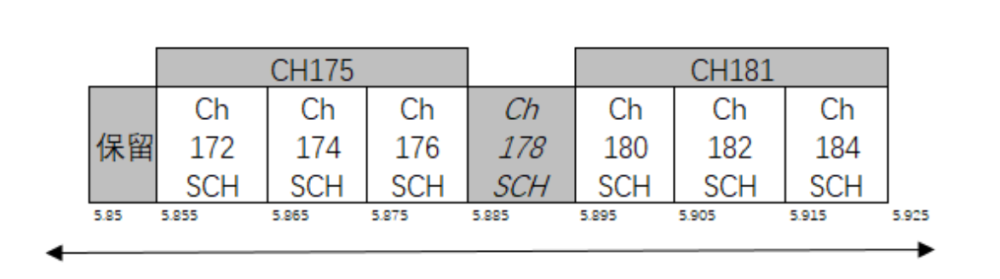

Figure 2-2 FCC 

The IEEE1609 protocol family is mainly composed of four parts [7]:

1. IEEE1609.1 (Resource Manager): defines the format of the control channel message and the format of data storage, and has formulated a number of remote application and resource management control call process specifications.

2. IEEE1609.2 (Security Services for Applications and Management Messages): It involves security issues in WAVE communication, including signatures, encryption and other tasks.

3. IEEE1609.3 (Networking Services): specifies the standards of the WAVE network layer and transport layer, including the connection setting and management of WAVE.

4. IEEE1609.4 (Multi-Channel Operations): Defines the related operations of multi-channel communication.

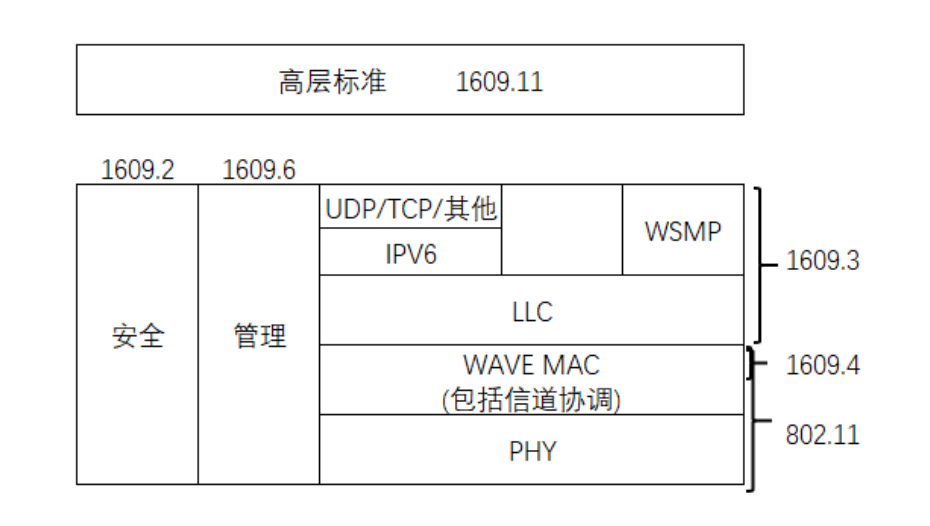

Figure 2-3 structure of 1609 protocol

### 2.2  VANET Simulation Architecture Based on Omnet++

#### 2.2.1 Introduction

The vehicle networking simulation platform used in this experiment is mainly composed of three basic parts: Omnit++ simulation platform, SUMO traffic simulation platform, and Veins vehicle simulation system. Among them, the Omnet++ simulation platform is the basic system framework for the simulation of the Internet of Vehicles, which is used to build a network simulator. SUMO provides microscopic, continuous simulation of vehicle road operation. The Veins framework runs on Omnet++, responsible for the communication between nodes, and communicates with SUMO through TraCI to synchronize the simulation of vehicle motion to the simulation of Omnet++ in real time.

The overall architecture is shown in Figure 2-4 below:

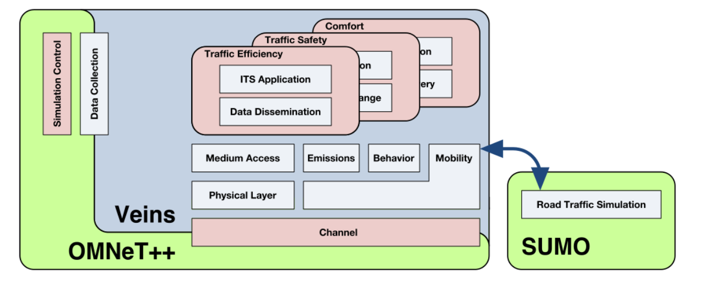

Figure 2-4 structure of simulation platform

#### 2.2.2  Omnet++ simulation platform

OMNeT++ (Objective Modular Network Testbed in C++) is an extensible, modular, component-based C++ simulation library and system framework. Developed by OpenSim, it is a discrete event multi-protocol network simulation software with a perfect graphical interface.

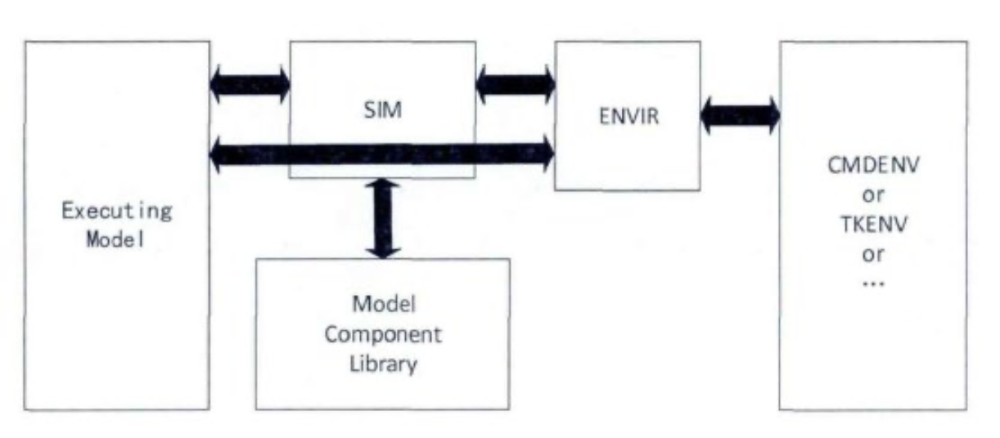

Figure 2-5 Omnet++ structure

Figure 2-5 above shows the framework of Omnit++. The SIM module provides the core of the simulation, which is the core of the simulation platform. The ENVIR module provides the public code of the user interface and connects to the user interface. Both CMDENV and TKENV are user interfaces. CMDENV is a command line interface and TKENV provides a graphical user interface, so the corresponding operating speed is also reduced. Model Component Library stores the defined modules, models, messages and other simulation-related content. The Executing Modle module is an instantiation description of the actual operation.

Omnet++ provides tools, interfaces and corresponding simulation frameworks for network simulation. It provides a wealth of C++ simulation prototypes. At the same time, Omnit++ provides a set of effective tools for system structure simulation: embedded layered modules.

Omnet++ organizes and describes the network structure through the nesting of modules. Among them, a simple module is a module that realizes a simple single function. A new module formed by embedding multiple simple modules into one module is called a composite module. There is no limit to the nesting of modules, and when the module is instantiated, for users, there is no difference between a simple module and a conforming module. These features make it easy for users to divide a complex structure into multiple simple module stacks.

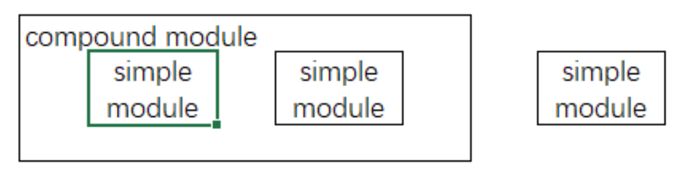

Figure 2-6 Module nesting digram

Modules are connected through "Gate" or "interface" to communicate and realize module nesting. The input/output interface of the store module, the message is sent through the output gate, and received through the input gate. By connecting the doors to each other, messages can be transmitted between different sub-modules (simple modules) or connected with parent modules (composite modules). You can add content such as delay and acceleration while connecting the door.

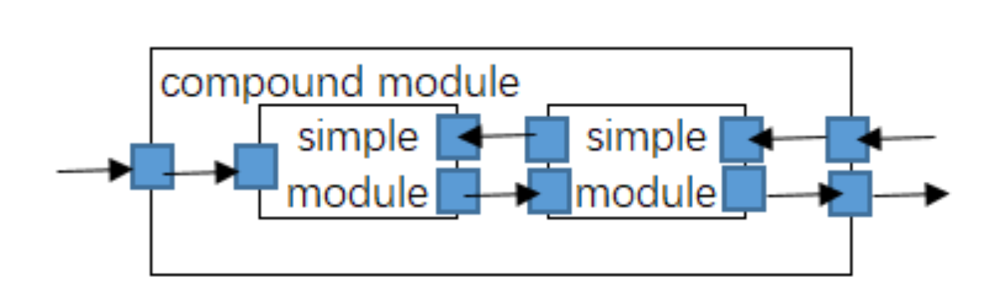

Figure 2-7 Module connection diagram

The way to realize communication between modules connected to each other is to exchange information. The message can include any complex data structure. By defining the frames and packets in the network, it is possible to simulate the message propagation in the Internet of Vehicles.

The Omnet++ simulation platform is divided into two modules: topology design and function programming. The physical node configuration uses NED language. NED (Network Description) language is used to describe the structure of the simulation model. The definition of a module is divided into four parts in the NED language: parameters, gates, submodules, and connections. Parameters can be directly described inside the module, or they can be assigned uniformly in omnet.ini.

Each physical node must have a corresponding function definition, which is described in c++. Through flexible inheritance and interface mechanisms, more complex functions can be implemented for the module. You can also use the nesting mechanism of ned to write a single function for a simple module and then add a new function to the complex module formed by stacking. Omnet++ provides users with a rich class library. Users can quickly implement the functional description of the required network through inheritance and rewriting.

#### 2.2.3  SUMO traffic simulation platform

SUMO (Simulation of Urban Mobility) is an open source, micro, multi-mode traffic simulator. It can simulate the movement of a single vehicle in a given road network. Among them, each vehicle can be modeled in detail and has its own driving path; simulation parameters can be determined, or certain random parameters can be introduced. Because it complies with the GPL (General Public License) agreement, maps such as VISUM, VISSIM, Shapefiles, OSM or XML descriptions can be imported and used by SUMO. SUMO includes all relevant functions of traffic simulation, and can achieve the following functions in terms of modeling:

1. Vehicle movement with continuous space and discrete time.
2. Multi-lane roads with lane changes.
3. Vehicle driving rules and traffic light rules
4. openGL graphical interface.
5. Interaction with other applications. 

When using SUMO to build a traffic simulation model, the most important thing is road simulation and traffic flow model simulation. SUMO uses .xml files to describe the simulation environment. The main files related to simulation are as follows:

*.net.xml: Road network file, which defines road information.

*.rou.xml: Traffic flow file, which defines the route and behavior mode of vehicles.

*.poly.xml: Terrain file, which defines buildings in the map as a parameter of signal fading. 

*.launchd.xml: Establish communication with SUMO.

*.sumo.cfg: Parameter configuration file, which defines the conditions of SUMO operation, such as running time.

By using third-party open source maps, real map information can be quickly imported into SUMO. The more common method is to use openstreetMap to download the automatically generated osm map file, and then use the netconvert command to convert it to *.net.xml in SUMO. Another way is to use xml to manually write the traffic description file. The specific steps are as follows:

1. Define the node file *.nod.xml: The definition of the node mainly gives the coordinates of the node. At the same time, the nodes can be described, such as setting intersections, setting passing priority, setting signal lights and driving rules, etc.

2. Define the edge file *.edge.xml: define the edge to connect the defined nodes on the basis of the node definition. The side is directional. When the vehicle is driving along the side, it starts from the given from and ends with to. Edges can also define attributes, such as allow vehicles to pass.

3. Use the netconvert command to integrate node.xml and edg.xml into net.xml.

In rou.xml, the speed, size, generation time, and vehicle flow parameters of the vehicle can be described in detail. Make the traffic model closer to the actual traffic behavior and improve the accuracy of simulation analysis.

#### 2.2.4  Veins vehicular network simulation platform

In order to better model and simulate the vehicle network, it is necessary to combine the vehicle movement model with the network simulation. The relationship between the existing vehicle movement model and network simulation can be divided into two ways: open-loop coupling and closed-loop coupling. In the open-loop coupling, the vehicle's motion and network simulation are independent of each other and do not affect each other; in the closed-loop coupling, the vehicle's motion is not only used as the input and communication decision condition of the network simulation, but also the communication transmission in the network simulation. The structure will in turn affect or change the movement of the vehicle.

Closed-loop coupling is divided into embedded coupling and joint closed-loop coupling. The joint closed-loop coupled vehicle networking modeling and simulation method is to jointly use the existing mature traffic simulator and network simulator, and communicate with certain criteria. The structure realizes the interaction, as shown in Figure 2-8:

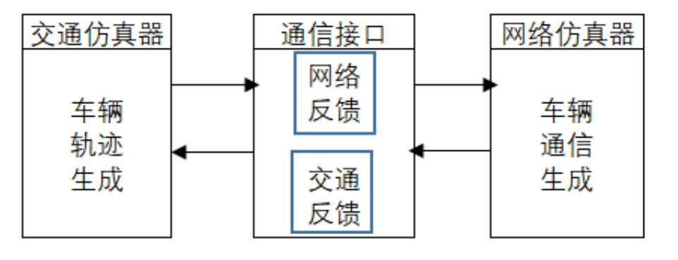

Figure 2-8 Joint close-loop structure

Compared with the embedded closed-loop coupling method, the joint closed-loop coupling mode simulation platform has traffic simulators and network simulators that have undergone extensive verification and are recognized as highly reliable platforms. VEINS is a traffic simulation and network simulation platform that uses SUMO and Omnet++, which are also based on C++, respectively. The communication interface uses TraCI, which is an excellent vehicle networking simulation framework.

Veins (Vehicles in Network Simulation) is an open source Internet of Vehicles simulation platform based on Omnet++, which can conduct online interactive simulation with the SUMO traffic simulation platform through TraCI. Its composition system is shown in Figure 2-9:

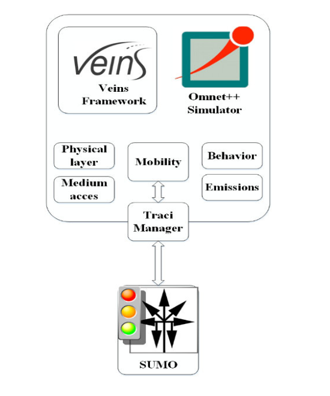

Figure 2-9 Veins framework structure

Veins instantiates the vehicles in SUMO as nodes in the network, which is specifically implemented by the *TraCIScenarioManagerLaunchd* module in Omnet++. The *TraCIScenarioManagerLaunchd* module connects with SUMO to customize vehicle creation and vehicle movement messages. Each car created in SUMO will be instantiated as a composite module in Omnit++, and the composite module contains a mobility sub-module, *TraCIMobility*. The *TraCIMobility* module contains the function of stopping when the vehicle arrives at a predetermined position, that is, to realize the occurrence of traffic accidents in traffic simulation, and set the *accidentStart* and *accidentDuration* parameters accordingly. The application layer module in Veins can use the *TraCICommandInterface* class and related classes to obtain *TraCIMobility* parameters for information interaction with traffic simulation.

As for network simulation, Veins uses the OMENT++ platform to define WAVE short messages (WSM) at the application layer, and gives WSM definitions to realize the sending of periodic Beacon messages and Data messages. Secondly, the MAC layer of Veins implements the EDCA mechanism based on IEEE802.11p and the multi-channel switching mechanism based on IEEE1609.4. Finally, the physical layer of Veins implements the functions of the physical layer based on IEEE802.11p. In terms of channels, Veins implemented a fading model of interference and building obstacles to simulate the unlimited signal transmission of the real Internet of Vehicles. In the Veins simulation, the configuration of the channel interference model and the building obstacle fading model is realized through the xml configuration file.

### 2.3  the Principle of DDoS attack

DDoS (Distributed Denial of Service) attack is a distributed denial of service attack. It can be considered that any behavior that causes legitimate users to be unable to access the service normally is a "denial of service" attack [14]. However, DoS attacks initiated by a single attacking node are limited by its own body’s computing power and network bandwidth. Service providers with strong service provision capabilities in traditional networks are sufficient to handle the requests of a single attacking node, while a large number of other attacking nodes are organized and coordinated. , Attack from different locations at the same time, this is "distributed".

DDoS attacks are simple and difficult to prevent. It is one of the most threatening attacks on the Internet [6]. None of the current defense methods can effectively prevent DDoS attacks, and can only be countered by increasing resources. In the Internet of Vehicles environment, the rapidly changing topology environment, the shortage of wireless communication channel resources, and the vulnerabilities in the protocol have caused new changes in DDoS attacks. Especially in terms of security message dissemination, because Vanet uses short and simple WAVE Short Message (WAVE Short Message, WSM) broadcasts for security message dissemination, DDoS for security message dissemination has new features that are different from traditional networks.

In the Internet, SYN Flood attacks are the most common DDoS attack. It uses the loopholes of the TCP protocol to shake hands three times to occupy a large amount of server half-open connection resources. However, the security messages in the Internet of Vehicles are transmitted by broadcast, and the TCP protocol is not used, so SYN attacks cannot be carried out. At the same time, the node that receives the WSM security message does not need to issue a receipt, so Smurf attacks and DRDOS attacks cannot be carried out.

## 3  Design of DDoS Attack Against VANET

### 3.1  VANET Data Transmision Vulnerability

Through careful analysis of a typical VANET communication scenario, combined with the WAVE protocol used by the VANET, the most important security message propagation vulnerability of VANET can be analyzed.

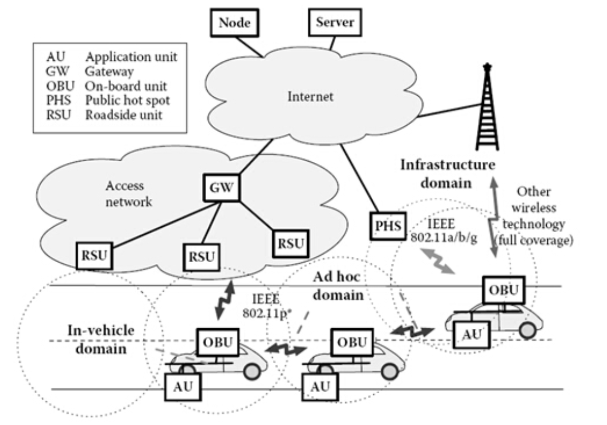

Figure 3-1 communication scenario of VANET

As shown in Figure 3-1, VANET communication is mainly in two aspects: OBU-OBU means vehicle-to-vehicle communication, and OBU-RSU means vehicle-roadside unit communication. The OBU node sends the safety message directly to the neighboring OBU node and RSU node through the broadcast method, and the RSU node and OBU node receiving the message will also forward the safety message. In this process, the sending of messages follows the WAVE protocol, and in order to quickly deliver public and secure messages, there is no privacy mechanism for the message itself. Limited by hardware performance and information disclosure requirements, there are no rigid requirements and effective means for the legal identity authentication of the sender. Therefore, it can be seen that V ANET communication has the following vulnerabilities:

1. Every data transmission needs to use the CSMA/CA back-off mechanism, resulting in effective information may be squeezed into the channel by useless or attack information for a long time, and it is difficult to be transmitted and processed. As shown in the above figure, if there is a message burst, all OBU nodes and RSU nodes need to compete for the channel, which will cause a large number of message collisions.

2. The secure broadcast message does not have identity authentication, and the content does not have valid authentication, so it is easy to be counterfeited by attackers. Each OBU in the figure above may be a malicious node or an illegal node.

3. The sending node does not have valid identity authentication and cannot confirm whether it is a malicious node. The security messages transmitted between nodes in Figure 3-1 above do not have an effective security mechanism for verification.

### 3.2  Design of Attack Scheme

Based on the above information, this article designs a DDoS attack scheme for the propagation of secure messages.

This experiment uses a flood attack method, using malicious OBU nodes and malicious RSU nodes to send a large amount of invalid information to other legitimate nodes in the network in a short period of time, thereby causing channel blockage, making effective security messages sent by legitimate nodes impossible be detected by subsequent nodes, and causing road congestion. This attack can make the attacked node continue to fall into the invalid information sent by the malicious node. From the perspective of the victims, most of the information received by the OBU node is directly sent by malicious nodes or false information forwarded by other nodes, which causes errors in the lane selection strategy and causes road congestion. And because the network is full of malicious information that is continuously accepted and forwarded, most of the messages received by RSU nodes are malicious messages. The forwarding and broadcasting of RSU will become part of the attack in disguise, causing more severe impact on subsequent vehicles.

The attack process is shown in Figure 3-2:

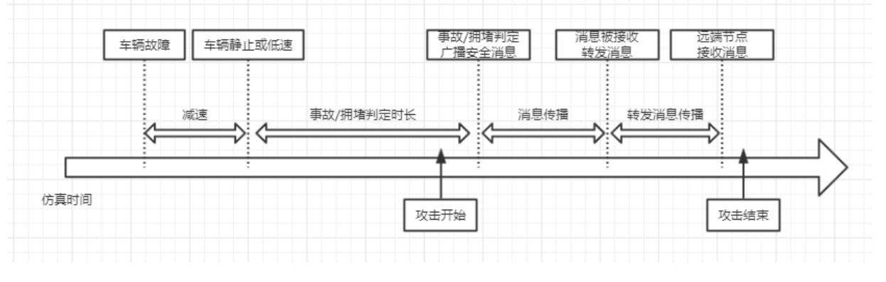

Figure 3-2 the process of attack

Step 1: The malicious node sends invalid information
Step 2: An incident occurred in the network
Step 3: The node where the accident occurred sends an accident message
Step 4: Network congestion affects the dissemination of accident messages and even gets discarded

Three sets of attack scenarios were designed in the experiment, and DDoS attacks were carried out against the accident vehicle, the receiving vehicle and the RSU node respectively.

#### 3.2.1  DDoS attacks agains accident vehicle

The attack scenario of this scheme is that when a traffic accident occurs, the target of the attack is the vehicle inverter in the traffic accident. To interfere with the normal security broadcast service interrupted by the interruption alarm. The attack process is as follows:

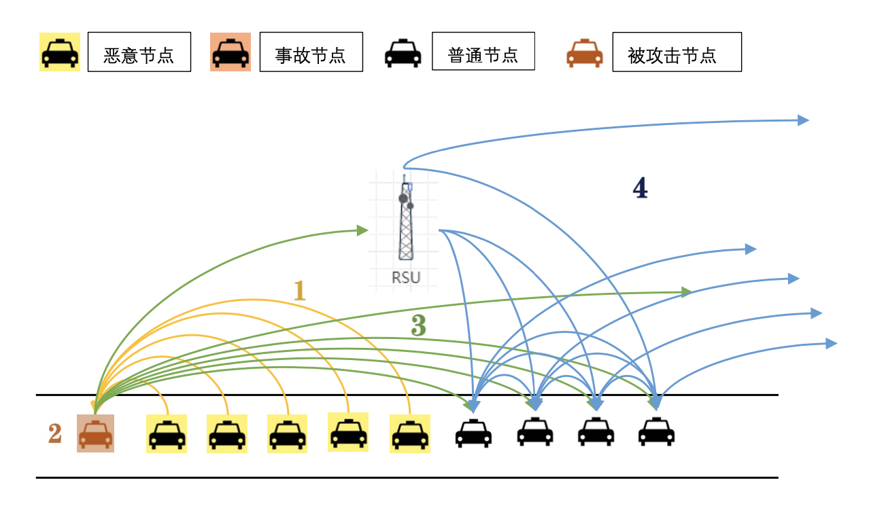

Figure 3-3 the communication process of attack scheme 1

The message delivery and events in the entire attack process are shown in the figure above:

1. The malicious node (the black car in yellow square) launches a DDoS attack on the node at the head of the traffic team (the set accident node).
2. A traffic accident occurs at the vehicle node at the head of the team (the red car in red square).
3. The accident node sends a security broadcast to the subsequent vehicle node (black car) and RSU while withstanding the DDoS attack.
4. While the malicious node continues to attack the accident node, other nodes receive the message, broadcast and forward the message, and generate redundant information which is repeatedly received by the node.

#### 3.2.2  attack scheme against information receiving nodes

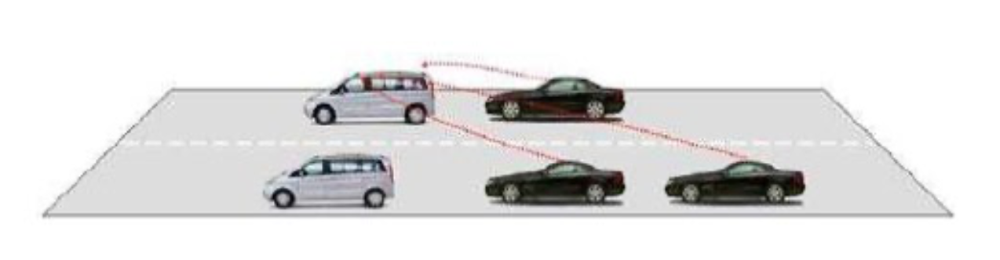

Figure 3-4 Schematic diagram of attack plan 1 & 2 model

In Figure 3-4 above, the black vehicles are malicious nodes, the gray vehicles are legitimate OBU nodes, and the red arrows represent malicious nodes attacking them.

The message delivery and events in the entire attack process are shown in the following figure 3-5:

1. The yellow malicious node (black car in yellow square) launches a DDoS attack on the attacked node.
2. The vehicle node at the head of the team has a traffic accident (black car in red square) and sends a safety broadcast to the subsequent vehicle nodes and RSU.
3. The attacked node (red car) receives and forwards the security message broadcast by the accident node while withstanding the DDoS attack.
4. While the malicious node continues to attack the attacked node, other nodes receive the message, broadcast and forward the message, and generate redundant information that is repeatedly received by the node. 

The attacked node can be within the coverage of the one-hop message of the accident node, or it can be at the remote end (relayed by other nodes). The location of the attacked node on the way is for illustration only.

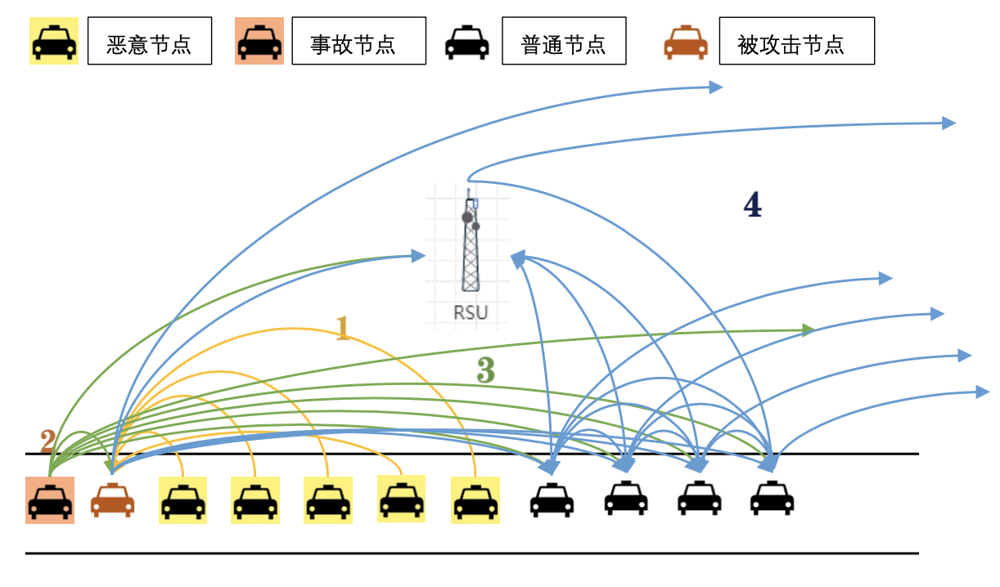

Figure 3-5 the communication process of attack scheme 2

#### 3.2.3  attack scheme against RSU nodes

This attack scheme is to use malicious nodes to conduct DDoS attacks on RSU nodes responsible for forwarding security messages. The specific attack process is similar to the second scenario.

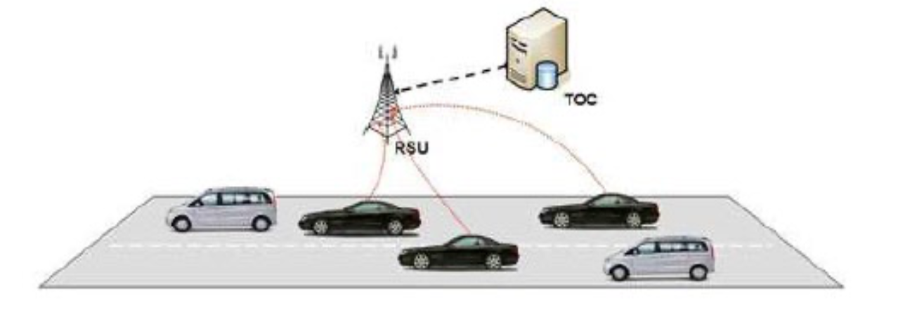

Figure 3-6 attack scheme 3 model

### 3.3  Design of Netwokr Performance Standard

#### 3.3.1  communication delay

In the VANET, WSM is responsible for disseminating traffic accident information. Therefore, the most important goal of WSM is to generate data packets in time and transmit them to other routines for processing. According to this goal, the communication delay of WSM data packet is defined as:

*The time from when the message is generated, processed by the sending routine and sent over the wireless channel, to when it is received and processed by the target decoder.* 

As shown in Figure 3-7 below:

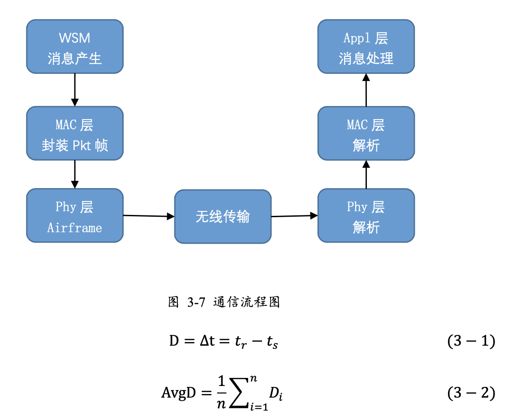

𝑡𝑠:  In the simulation process, when a node triggers a traffic accident judgment (the length of the driving speed is 0>=10s), the time to generate a new safety message broadcast.

𝑡𝑟:  Indicates the time when a node receives a WSM traffic safety broadcast and starts to process the message at the application layer.

The time difference between the $ts$ and $td$ is $D$, and the average receiving delay of all receiving nodes for a certain safety message broadcast is $AvgD$.

Since Omnit++ is a discrete event simulation platform, every discrete event will be processed sequentially. Therefore, no matter how strong the attack is, by slowing down the simulation speed, all events can always be processed. In this experiment, by defining the maximum delay limit from the occurrence of an accident to the receipt of a security message, it is judged whether the attack will affect the sending and receiving nodes and the network, that is, denial of service.

#### 3.3.2  transmission performance

In the VANET, there is a lot of redundant information. Each OBU node will regularly broadcast the road condition information, and other receiving nodes will relay the information to the remote node. Therefore, except for the first reception of the information packet, other information in the network is redundant to the node. In contrast, data packets sent by DDoS attacks are also redundant information for nodes.

It is precisely because the network is full of redundant information that the delivery of messages in the complex and changeable ad-hoc network can be guaranteed. However, due to the existence of the conflict avoidance mechanism, the transmission of excessive redundant information also aggravates the conflict and collision of messages and squeezes the channel resources of effective information. In an ideal situation, if the maximum number of nodes can receive a message every time a message is sent, then the redundant information in the network is the least, and the transmission efficiency is the highest. Therefore, the important thing for a node is not how much information it has received, but whether it can receive valid information in time, without delay due to conflicts of redundant information, or even failing to receive valid information.

On this basis, the number of valid messages in VANET is equal to the number of nodes that receive valid messages. Based on the signal-to-noise ratio formula, the design formula is as follows:

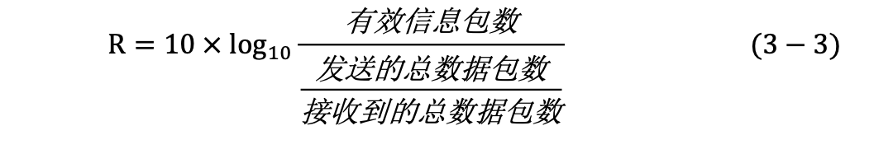

Consider the loss of data packets. If the channel condition is good, then more data packets can be successfully received, and the number of lost packets will be less.

The larger the R value, the more nodes in the network that receive effective information, the fewer redundant packets, the lower the packet loss rate, and the higher the transmission efficiency of the entire network. The smaller the R value, the lower the network efficiency.

## 4  DDoS Attack Simulation in VANET

### 4.1  Design of Simulation

This experiment is to explore the impact of DDoS attacks on traffic and network loops in VANET networks. According to the foregoing, the realization of the traffic flow is realized through the two-way communication between SUMO and Omnit++, so the data field of the WSM data packet can be modified to realize the reverse impact of the network attack on the traffic flow.

This experiment is basically divided into two parts. One is to build a simulation environment, including Omnit++, SUMO, Veins. The second is to design and implement basic scenarios and attack schemes. Through comparative analysis of the impact of DDoS attacks on the VANET simulation environment. 

### 4.2  Veins Frame Structure and Operation Process

#### 4.2.1  Veins component structure

Veins implements the most basic components and protocols of the VANET, and its structure is shown in Figure 4-1:

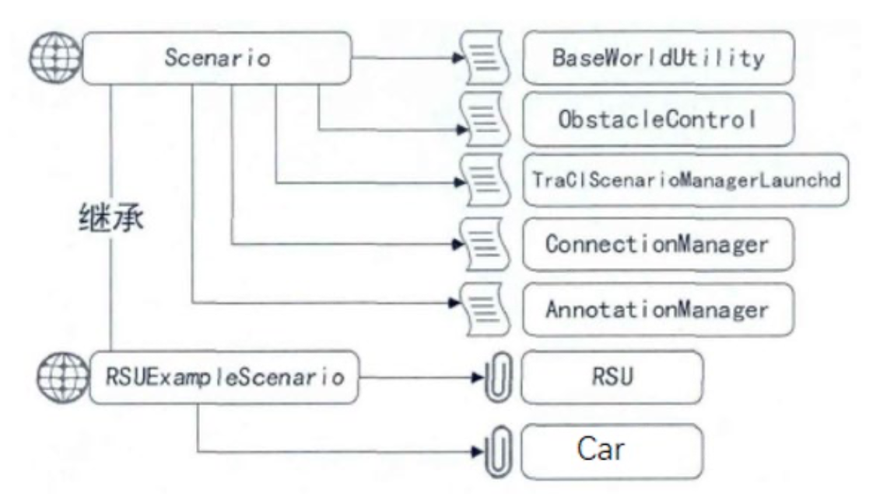

Figure 4-1 veins component structure

The VANET scenario designed by `RSUExampleScenario` for Veins is an extension of the `Scenario` network scenario. RSU is added to the `Scenario` network scenario. The sub-modules included are [12]:

1. `AnnotationManager` module: Animation management in Omnet++ simulation, which is used to display all the marks, icons, prompts, etc. that are generated during the simulation and need to be displayed graphically.

2. `ObstacleControl` module: to realize the influence of obstacles in radio propagation, in which each obstacle is simulated as a polygon.

3. `BaseWorldUtility` module: Provide information such as scene size, airborne data frame identification and corresponding scheduling use in network simulation.

4. `ConnectionManager` module: Determine the communication range or the interference range between routers in the network according to the transmission power, the radio wave wavelength path loss coefficient and the minimum received power. It is used to process all the connections in the simulation and process related and packet loss operations.

5. `TraCIScenarioManagerLaunchd` module: connect to the running instance in the `sumo-laumchd.py` script at the beginning and the end of the simulation, which is the `TraCIScenarioManager` module's interface to realize the automatic loading or ending of the forces in SUMO. Responsible for the two-way coupling communication and interaction with SUMO during the simulation process.

6. `RSU` module: used to implement the RSU node.

7. `CAR` module: used to implement the OBU subsystem.

In Veins, `RSU` module and `OBU` module are composed of three modules: application layer `appl`, transport layer `nic`, and mobile control `mobility`. Among them, the nic module adopts the physical layer based on the IEEE802.11p protocol in the Internet of Vehicles and the MAC layer module based on IEEE1609. The difference between the two lies in the function of the application layer and the basis of the mobile module.

The module call hierarchy of the RSU node is shown in Figure 4-2:

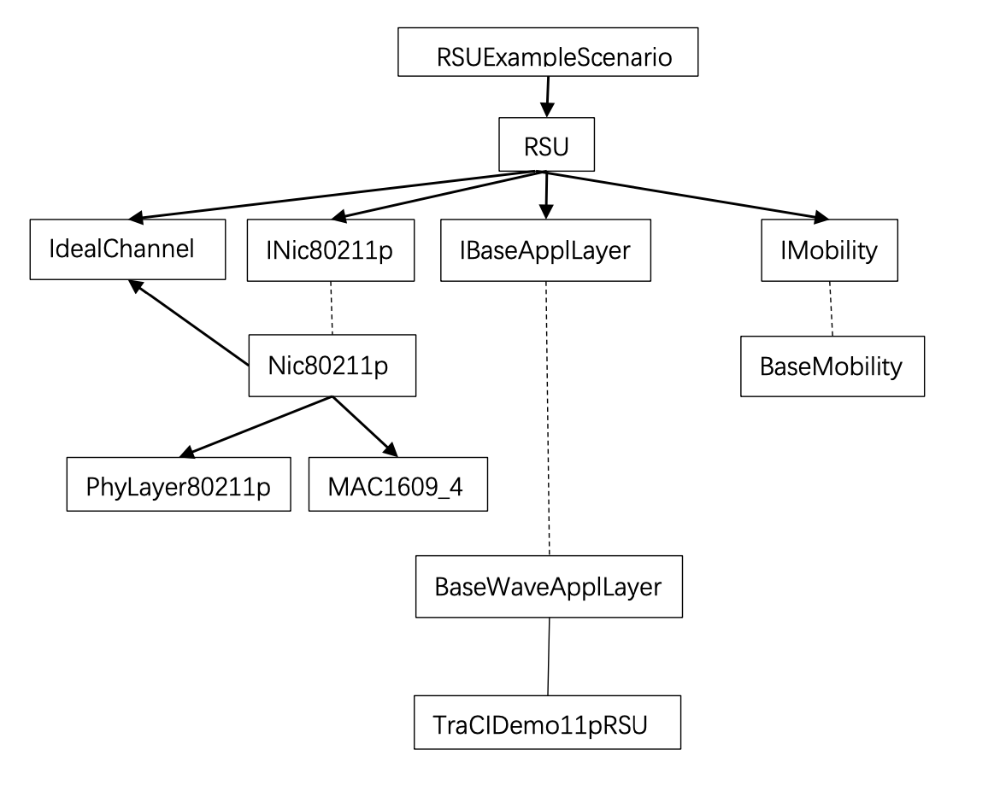

FIgure 4-2 RSU node module hierarchy diagram

The RSU module consists of three modules: `appl`, `nic` and `mobility`.

The functions of the main sub-modules are as follows:

- `IdealChannel`: A theoretical channel model with no interference, no packet loss, and zero transmission time. It is a statement of a simple channel model. As the specific parameters of the channel in the Veins simulation process will continue to change with the progress of the simulation, the delay, speed and other parameters need to be adjusted continuously, which cannot be directly determined during the definition. Therefore, the IdealChannel model is used to establish a connection, and the parameters are determined in real time as the simulation progresses. As mentioned above, the terrain file `.poly.xml` in SUMO produces obstacles and transmission fading such as interference

- `Nic80211p`: It is the transport layer of `OBU` (Car) module and `RSU` module, which is called through the `INic80211p` interface. It consists of two sub-modules, the MAC layer module `Mac1609_4` module and the physical layer module `PhyLayer80211p` module, which implement the WAVE protocol.

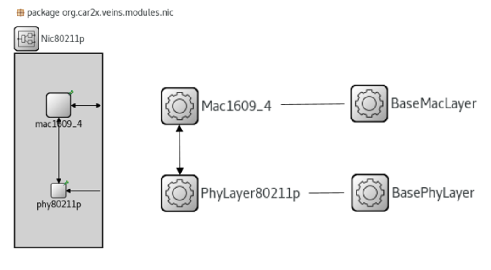

FIgure 4-3 NIC80211p structure

- `BaseWaveApplLayer`: The basic class of the application layer protocol, which is inherited from the corresponding BaseApplLayer in the base library and is called through the `IBaseApplLayer` interface. It implements the basic application of the WAVE protocol. The vehicle node OBU generates the application layer description file `TraCIDemo11p` of the Car module through the expansion of the module, and the RSU node generates `TraCIDemoRSU11p`. The difference between them is that the Car module has to deal with the vehicle movement and the communication interaction caused by the movement, while the RSU module is static, and according to its definition in the WAVE protocol and related to the purpose of this experiment, it only needs to process message forwarding. Compared with the OBU module, the function of the RSU is much more single.

- `BaseMobility`: control node location information. It is a static model and can only provide relevant position parameters for RSU nodes. `IMobility` is the interface of `BaseMobility`. By expanding on the basis of `BaseMobility`, it is possible to have `TraCIMobility` that describes mobile location information, which can be used by OBU nodes.

Car nodes use the similar module call structure of RSU nodes, and the difference is mainly in the processing of location information and mobility. By using the `IMobility` interface, the Car node expands the `BaseMobility` module. `TraCIMobility` can monitor, increase, and control OBU nodes in the network in real time in Omnet according to the running status of SUMO.

The module call hierarchy of the Car node is as shown in Figure 4-4:

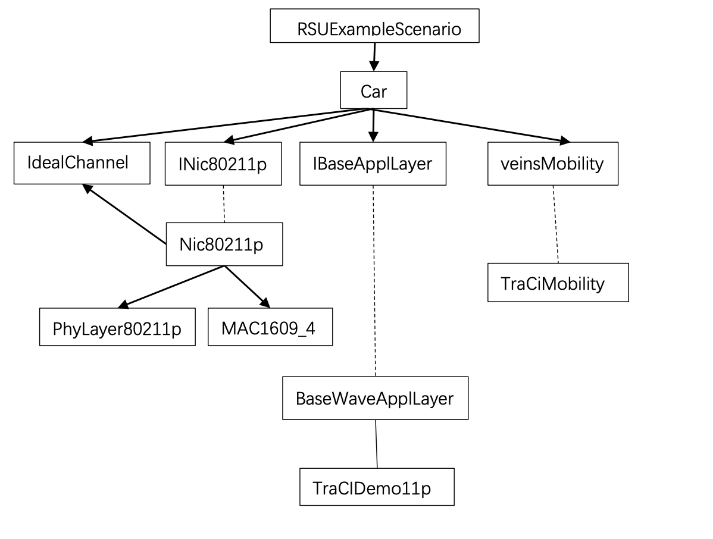

Figure 4-4 Car nodes module hierarchy diagram

#### 4.2.2  configuration of instances in Veins simulation 

The modeling realization of the RSU module, its specific design and composition are shown in Figure 4-5:

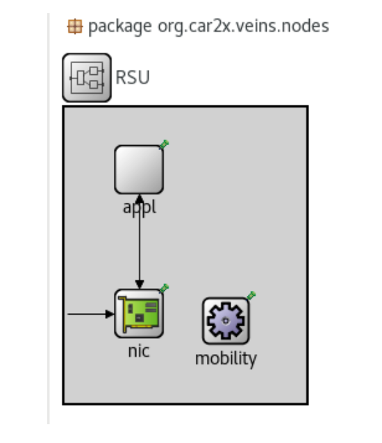

Figure 4-5 RSU node module structure

- Application layer type of RSU node: `applType=TraCIDemoRSU11p`.

- Location and mobility of RSU nodes: `Mobility=BaseMobility`.

- The RSU node application layer does not send periodic messages, but sends data messages and only sends them in the CCH of the Internet of Vehicles.

  That is, `appl.sendBeacons=false`, `appl.sendData=true`, `appl.dataOnSch=false`.

- The data priority sent by the RSU node is 2, that is, `appl.dataPriority=2`. 
- SCH does not apply to Mac1609.4 in the network interface, that is, `nic.mac1609_4.useServiceChannel=false`.

- The module type in TraCIScenarioManager `moduleType=org.car2x.nodes.car`

The modeling realization of the Car module, its specific design and composition are shown in Figure 4-6:

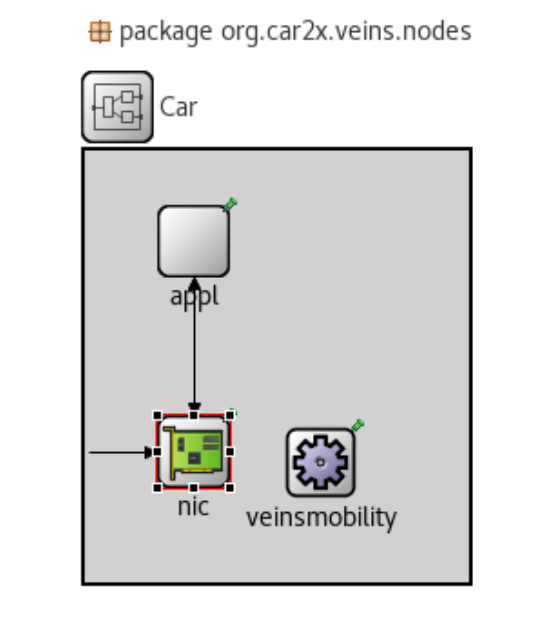

Figure 4-6 Car node module structure

As shown in Figure 4-6, the model of the vehicle node in SUMO in Omnet consists of `appl`, `nic` and `veinsmobility` modules. The parameters of Car are:

- Car application layer type definition `node[*].applType=TraDIDemo11p`.

- Car does not send periodic messages, sends data and no longer sends data on SCH, that is, `node[*].appl. sendBeacons=false`, `node[*].appl.sendData=true`, `node[*].appl.dataOnSch= false` .

- Car sent data priority `node[*].appl.dataPriority=2`.

- Car mobility wipes the real-time position, speed and acceleration of the vehicle in the traffic simulation SUMO, namely `node[*].veinsmobilityType=org.car2x.veins.modules.traci.TraCIMobility`.

- In the simulation, a vehicle with a vehicle id of 0 has a traffic accident at 75s, and the accident duration is 30s.
  That is, `node[*0].veinsmobility.accidentCount=1`, `node[*0].veinsmobility.AccidentStart=75s`, `node[*0],veinsmobility.accidentDuration=30s`.

It can be seen from the simulation parameter configuration that in the simulation process, when the vehicle has a traffic accident, the data related to the traffic accident will be sent on the CCH, and the RSU will also forward the corresponding data after receiving the corresponding data.

#### 4.2.3  Veins simulation process

This section will analyze the message passing and function call in the Veins simulation process.

1. In the `initialize()` function of the `TraCIMobility class`, `startAccidentMsg` is generated according to the `accidentStart` parameter set in the `omnetpp.ini` configuration file and added to the dispatch queue.

2. When the `handleSelfMessage()` function of the `TraCIMobility` class handles the `startAccidentMsg` when a staff accident occurs. First call the `commandSetSpeed` function in the `TraCIMobility` class, set the driving speed of the corresponding vehicle in the SUMO simulation to 0 through the `TraCIScenarioManager` class. Then generate `stopAccidentMsg` according to the `accidentInterval` parameter set in `omnetpp.ini`, and add it to the message queue.

3. The `handlePositionUpdate()` function in the `TraCIDemo11p` class obtains the current vehicle speed through the `getSpeed()` function of the `TraCIMobility` class. If the current vehicle speed is less than 1, and the time since the last update is greater than or equal to 10s, it is judged that the vehicle has a traffic accident. First, update the color of the corresponding node in the simulation scene to red; then, if the accident has not sent a safety message, that is, sendmessage is false, call the `sendMessage` function in the `TraCIDemo11p` class.

At this point, the scene preparation work before sending the message has been completed, and the next step is the formal message generation phase. The first step in this phase is to generate a message.

As mentioned in the first section of this chapter, Omnit++ uses messages to deal with communication issues between modules. The message file `msg` can realize the transmission of complex data through a custom data structure, or directly transmit simple character data. The Veins simulation framework uses the `WaveShortMessage.msg` file to define the data packet format in the VANET. Its instantiation is the safety message `WSM`, which is used to transmit traffic safety information between the vehicle and the vehicle, and between the vehicle and the roadside unit. The last message to be sent in step 3 mentioned above is the `WSM` message. Whenever a vehicle encounters a traffic safety-related event such as a traffic accident or traffic jam, it will call the corresponding function at the application layer to broadcast WSM messages. In order to disseminate safety information quickly, `WSM` has the characteristics of quick response and short size.

Before calling the sendMessage function, `TraCIDemo11p` will first call the `populateWSM()` function to define the packet header. The data field `data` is put into the corresponding current road id information in SUMO by calling the `veinsmobility.getRoadId()` function.

The content of the WSM message is shown in the figure below:

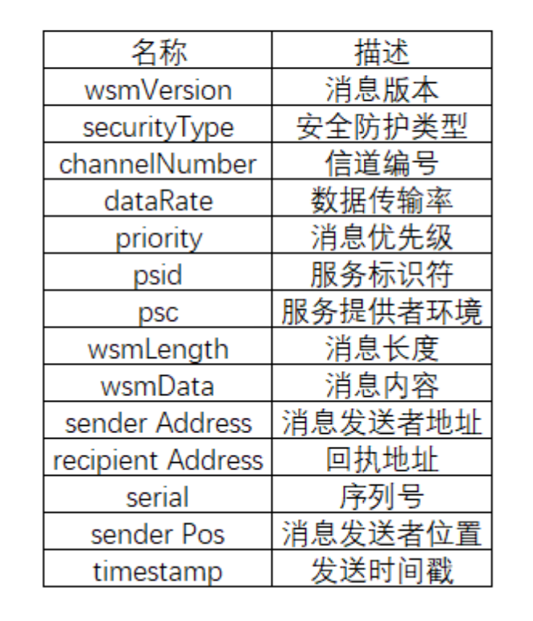

Figure 4-7 WSM content

Important information fields of `Waveshortmessage.msg` include:

- senderAddress: The address of the sending node.

- senderPos: The position of the sending node (indicated by coordinates).

- timestamp: The timestamp of the time the letter was sent.

- wsmData: The data field of the message, the payload of WSM, is provided by the higher layer.

After finishing the preparations for sending the WSM message, the newly generated WSM will be passed to the lower layer protocol processing by the node. The node module calls the function `sendDown()` and the function is passed from the `appl` module to the `nic` module by the gate. In the nic module, it will be processed by the mac layer and the physical layer respectively. In order to simulate message processing more realistically, the `sendDelayDown()` function can be used to send the WSM to the lower module after a certain delay, which can simulate the time consumption of message processing by the OBU node under real conditions to a certain extent.

4. The `sendMessage` of the `TraCIDemo11p` class first sets `sendMessage` to true, and then determines whether the sending channel of the data is SCH or CCH according to the `dataOnSch` parameter value; secondly, calls its parent class-the `populateWSM()` function in the `BaseWaveApplLayer` class for data framing; finally calls The `sendDown ()` function sends data to the `Mac1609_4` module in the protocol stack.

   The parent class `BaseWaveApplLayer` realizes the communication and control between the `TraCIDemo11p` module at the application layer and the Mac layer module `Mac1609_4` by calling the `WaveAppToMac1609_4Interface.h` interface module.

The next stage is message transmission. In this stage, the WSM message generated by the application layer will be received and processed by `MAC1609` and `nic80211p` and then sent by the wireless channel.

5. After the `handleUpperMsg()` function in the `Mac1609_4` class receives the message, it adds the message to the EDCA queue of the corresponding channel according to the specified transmission channel type in the message, and uses the EDCA mechanism to send the message.

According to the WAVE protocol, the transmission of safety messages in Veins does not require the use of TCP protocol and identity authentication mechanism (the purpose of safety messages is to broadcast current road information to surrounding nodes as soon as possible, without privacy). Veins uses the CCH control channel to broadcast the WSM message, and other nodes that receive the message will forward the message once if it receives the security message for the first time. This relay propagation can quickly deliver messages to distant nodes that cannot directly receive safety messages.

In the message sending stage, the work of the Mac1609_4 module mainly includes the following points:

- (1).  Determine the channel type (SCH, CCH) used by the wsm packet sent by the `appl` layer, and switch the channel.

- (2). Put the WSM package into the EDCA queue and process it.

- (3). Generate other parameters of `macPacket`

- (4). Assign MAC address, assign source address and destination address for `macPacket`.

- (5). Encapsulate and generate the mac layer format package of `Mac80211Pkt.msg`.

- (6). When the edca queue mechanism is executed, the Mac layer format packet is sent to the phy physical layer, or discarded at the mac layer.

Through the `Mac80211pToPhy11pInterface.h` interface, the Mac layer module `Mac1609_4` realizes the mutual control and communication with the physical layer module `PhyLayer80211p`.

The main tasks of the `PhyLayer80211p` module in the simulation process are as follows:

- (1). Set the attributes and encapsulate the MAC layer frame into `AirFrame.msg` package.

- (2). Obtain signal fading, power and other information from the parameter configuration, and establish analog communication for this communication.

- (3). Use decider to determine the timing of sending.

- (4). Monitor the channel and prepare to receive information.

- (5). Judge whether the receiving node can receive the message by calculating the signal strength.

  

After the `Phy80211p` module completes the corresponding work on the physical layer, the `Decider80211p` module takes over the AirFrame package and is responsible for handling the conflict avoidance and air transmission of the message. The monitoring function of whether the data packet can be sent and whether the current time slice is free is implemented by Decider.

The final stage is the reception and processing of messages. This is basically the opposite of the message sending phase at the physical layer and the Mac layer. When the message is received by the `Phy80211p` module by the radioin gate and sent up to the `Mac1609_4` module, the Mac module will compare the Mac address in the frame and discard the messages that do not belong to itself. After the message is passed up from the `MAC1609_4` module layer to the application layer, the `onWSM()` function will coordinate with the SUMO and `TraCIScenarioManager` modules to do specific process on message.

6. After other vehicles in the simulation network receive the traffic accident message, if their `TraCIDemo11p` class has not forwarded the message, the function is called to forward the traffic accident message. The RSU nodes in the network will also make the same message forwarding decision after receiving the message.

The forwarding and processing of messages are implemented using the `onWSM()` function. It is divided into two versions according to the functions of RSU nodes and OBU nodes. The two differ only in handling movement and location information. After the message is sent to the application layer and received by the `onWSM()` function, the function obtains the data field of the WSM packet and obtains the `roadID` of the road section where the accident vehicle is located, and compares it with its current road section and the planned driving section. If you need to change the road to To avoid traffic congestion, the `changeRoad()` function will be called to use `TraCI` to re-plan the road for the vehicles in SUMO. After that, the forwarding judgment is performed as described in step 6.

### 4.3  Simulation Platform Construction

#### 4.3.1  construction of simulation software and system

The LTE function of Veins can only run in the Linux environment. Considering the follow-up research of the simulation platform, this experiment is built in the ubuntu virtual system.

By calling the command `python sumo-launchd.py –vv –c sumo-gui`, you can start the python monitoring script, start a SUMO instance listening port 9999 at the beginning of the simulation experiment, and communicate with Veins through the TraCI protocol.

#### 4.3.2  basic scenario establishment

First, establish the basic traffic flow model of the simulation scenario. Considering that traffic congestion caused by traffic accidents has the greatest impact on the intensive traffic flow, this experiment builds a traffic model based on the vehicle following model.

Set the number 0 car to have a car accident at the simulation time of 75s. The duration is 50s. Such a setting can make it impossible for several car nodes following car No. 0 to make the way in time, resulting in congestion. At the same time, the single report of car 0 is not enough to be transmitted to the remote vehicle node. It must be relayed by other vehicles. The actual impact of network information on the traffic flow can be observed. DDoS attacks on this basis are also more effective. The impact of the attack was observed.

The related parameter configuration has been described in detail in the previous article, so I won't introduce it again.

After configuring the relevant parameters and models of the experiment, the basic scenario is simulated as a comparison experiment for subsequent attack scenarios.

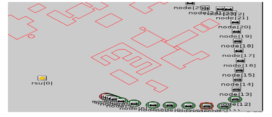

Figure 4-8 node topology diagram of basic simulation scenario

As shown in Figure 4-8, the red node No. 0 is the accident generation node in the setting, and it is also the head of the vehicle following model. No. 7 node is within the coverage of a single transmission of No. 0 node, and No. 14 node is outside the signal coverage of No. 0 node, and the accident message must be received through the relay of the preceding vehicle.

The accident node is set to car number 0. At 75s, the node starts the vehicle stop command according to the parameter setting. The vehicle started the accident determination timing at 76s and started to move again at 126s.

Figure 4-9 shows the basic scenario of node 0, node 7, and node 14 and the entire network data.

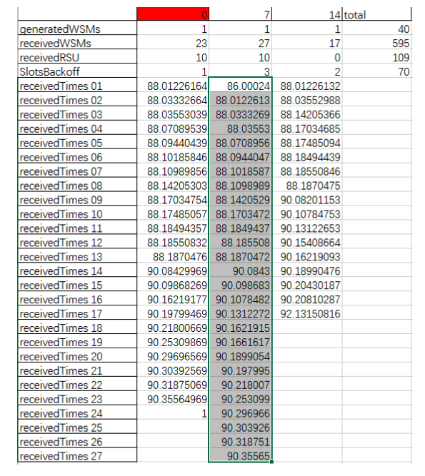

Figure 4-9 data of node 0, node 7, node 14 and the network in the basic scenario

As shown in Figure 4-9, when there is no malicious attack node in the VANET network, the message can be smoothly delivered to the node in time by broadcasting. Node 0 sent a safety message broadcast for the first time at 86s, and node 7 within one hop of it received the traffic accident message of node 0 at 86.0002s (approximately to the fourth decimal place) and processed it. . Due to the relay and forwarding mechanism established by the WAVE protocol, car No. 7 and other nodes that received the message broadcast of car No. 0 will forward the message, so it can be seen that car No. 7 has received a total of 27 traffic before the road is unblocked. Safely broadcast messages. The palm time of the last time was 90.3557s, which was only about 4 seconds after the car accident was judged and the first message was sent, and the average time was 0.15s.

It can be seen that the 14th node that needs to forward the message to receive the message first received the message at 88.0123s, which is about 2s latter from the first message broadcast. Considering that the node will have a processing time of 2s from receiving the message to forwarding the message, it can be considered that the reception delay of node 14 is almost zero, and the message is received in time. From the first reception to the last reception, the sharing time is about 4s, 17 data packets are received, and the average duration is 0.24s. It can be seen that the vehicle node far away from the accident source node has a longer reception delay. .

Due to the safety message broadcasting of the Internet of Vehicles, a large amount of communication occurs in a short time after the accident. Therefore, it can be regarded as a sudden process. In this process, because the WAVE protocol uses a back-off mechanism and redundant messages, each node will generate conflict back-off.

In the case of an basic scenario without any attack, the number of receiving nodes is 30, the number of received broadcast packets is 584, and a total of 40 data transmissions have been carried out. Therefore, the signal-to-noise ratio of the entire network at this time is R≈26.4.

In the case of not receiving an attack, starting from the 13th car, because it received the road accident broadcast message in time and did not drive into the road section where the accident occurred, the road can be changed in time. It can be seen that the vehicle made a U-turn and drove away from the congested road.

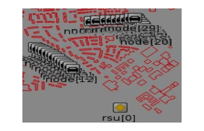

Figure 4-10 road-change diagram

### 4.4  Data Analysis

This section is the realization and analysis of the attack scheme in Chapter 3. Mainly collect data for analysis:

- `GeneratedWSMs`: The total number of WSM data packets sent out by this node during the simulation process.
- `ReceivedWSMs`: The total number of WSM data packets received by this node during the simulation process.
- `ReceivedEVILWSMs`: The number of times the node was attacked during the simulation.
- `ReceivedRSU`: The number of packets forwarded from the RSU node received by this node during the simulation process.
- `SlotsBackoff`: The number of backoff time slices for this node due to conflicts during the simulation.
- `ReceivedTimes[]`: The specific time of the message packet received by the node during the simulation process.

Based on the purpose of the attacking node, the problem of receiving the attacking node is not considered.

#### 4.4.4  conclusion of scenario analysis

Through the comparison of 5 sets of experimental data, it can be concluded that when multiple nodes attack the car nodes within the coverage of one hop signal of the vehicle in the accident, it will have a greater impact on the propagation of the safety message broadcast, which will make the remote car node havs obvious delays in the reception of accident information,  making it impossible to run the road guide service in time. The attack will also have a greater impact on network quality, increasing the packet loss rate, and the time slice conflicts.

#### 4.4.5  Attack intensity test

It can be seen that due to the increase in attack intensity, the number of attacks has increased significantly, but the attack effect is not positively correlated with the attack intensity as expected.

From the experimental data, increasing the attack intensity has no obvious impact on the security message broadcast between vehicle nodes. It can be seen that the number of time slice conflicts increases significantly with the increase of attack intensity and number of attacks, especially concentrated on attacking nodes. It did not cause more message conflicts between OBU nodes to back off. This means that the attacking node in VANET will not gain communication advantage due to the unlimited increase in attack intensity, and each attack still needs to compete for the time slice with other legitimate nodes. It can only reduce the network signal-to-noise ratio, increase network load and packet loss rate, and cannot completely hinder the dissemination of effective security information.

## 5  Conlusion

### 5.1  Simulation Review

This article mainly discusses the possible impact and characteristics of DDoS attacks in VANET networks. With the promotion and popularity of the concept of the Internet of Things, the plan for the Internet of Everything to enter people's lives has been put on the agenda. The Internet of Vehicles, as a way to solve traffic, safety and environmental problems, is essential to the study of the possible security threats. By using the simulation environment to study the Internet of Vehicles, the research cost can be reduced, and the research theory can be quickly verified in practice. As the most threatening attack method in traditional networks, it is necessary to analyze and simulate the possible impact of DDoS in VANET.

The main work of this paper is as follows:

1. Introduced the research background and significance of the Internet of Vehicles VANET, as well as the current Internet of Vehicles technology and research status.

2. Analyzed the working principle and possible vulnerabilities of the VANET based on the WAVE protocol family, and designed a corresponding DDoS attack plan.

3. Introduced the simulation platforms Omnet++, SUMO, Veins. And introduced the working process of the simulation platform.
4. Based on the previous article, a multi-scenario comparison experiment was designed, and through data collection for comparison, the factors that may affect DDoS attacks and the impact of attacks on VANET were analyzed.

Through experimental analysis, it can be seen that DDoS attacks will have a certain degree of impact on the VANET network, increase network burden, reduce transmission quality, increase transmission delay, and make messages unable to be delivered in time. However, the attack has an upper limit of impact, and it cannot completely block the sending and service of legitimate nodes.

### 5.2  Issues and Outlook

This design has the following problems:

1. Use an overly idealized simulation environment, which is far from the real scene.

2. The simulation platform is based on discrete events for simulation, and there is a time difference between each event, which makes it difficult to achieve true
parallel processing.

3. The processing capacity of the simulation environment is limited by the hardware platform, and it is difficult to handle large-scale and high-intensity scenarios and large-scale data.

4. This experiment focused on the attacks against security messages, but did not discuss service messages.

Although this experiment did not reach the ideal level of completely blocking the sending or receiving of the node, the threat of DDoS attacks to VANET can still be seen. Currently, the VANET lacks node identity authentication and data privacy processing, and there is no good way to deal with malicious attacks. In addition to designing more secure identification and data encryption, the Real-time monitoring of data and making autonomous defense strategies is a possible way to defend against DDoS attacks [15].

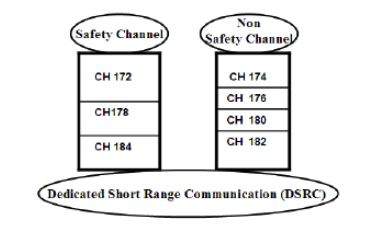

Figure 5-1 DSRC/WAVE protocol's channel condition under attack

As shown in Figure 5-1 above, since VANET uses 7 channels, it needs to select a channel for communication every time before sending a message. When a legitimate node detects an abnormality in the data flow in the network, it can negotiate with other legitimate nodes to quickly change the communication channel to avoid communicating through the channel that has been attacked and that is no longer secure, so as to temporarily exclude malicious nodes from communication network [15]. Through these channel assignments, whenever an attacker blocks any channel, he can choose to move to other channels. In this way, network availability can be obtained, thereby rejecting DOS attacks.

The DDoS attack scenarios designed in this simualtion could also be used to implement other attacks, such as relay attack and fake message attack. Also, veins frame provides a network layer interface, which means user could implement blackhole attack. 

## Reference 

[1] Toor Y, Muhlethaler P, Laouiti A, et al. Vehicle ad hoc networks: Applications and related technical issues[J]. IEEE communications surveys & tutorials, 2008, 10(3): 74-88.

 [2] 李明.VANET中基于802.11p的信道分配机制研究[D].吉林大学,2015.

 [3] Raya M, Papadimitratos P, Hubaux J P. Securing vehicular communications[J]. IEEE wireless communications, 2006, 13(5): 8-15.

[4] Lin X, Lu R, Zhang C, et al. Security in vehicular ad hoc networks[J]. IEEE communications magazine, 2008, 46(4): 88-95.

 [5] Dar K, Bakhouya M, Gaber J, et al. Wireless communication technologies for ITS applications [Topics in Automotive Networking][J]. IEEE Communications Magazine, 2010, 48(5): 156-162. 

[6] 冯柳平, 刘祥南. 基于 IEEE802. 11 认证协议的 DoS 攻击[J]. 计算机应用, 2005, 25(03): 546-547.

[7] 郭晋杰. 基于 IEEE 1609480211p 的智能交通系统的跨层优化[D]. 北京邮电大学, 2013. 

[8] Campolo C, Vinel A, Molinaro A, et al. Modeling broadcasting in IEEE 802.11 p/WAVE vehicular networks[J]. IEEE Communications letters, 2010, 15(2): 199-201.

[9] IEEE Guide for Wireless Access in Vehicular Environment (WAVE) – Architecture[J]. 2014:1- 77.

[10] 付浩彬.VANET下的无中心网络安全认证机制[D].吉林大学,2014.

[11] 周延熙. 面向车队自组网的移动模型及其多信道多跳路由协议研究[D]. 华南理工大学, 2014.

[12] 孙宁.VANET中DoS攻击仿真研究[D].吉林大学,2017.

[13] 吴振华胡鹏.VANET中路由协议分析[D].南昌航空大学软件学院,2015.

[14] 刘亚光.基于Linux防御拒绝服务系统的研究与实现[D].天津大学,2006. 

[15] Hasbullah H, Ahmed Soomro I, Ab Manan J. Denial of service (DOS) attack and its possible solutions in VANET[J]. World Academy of Science, Engineering and Technology (WASET), 2010, 65: 411-415.